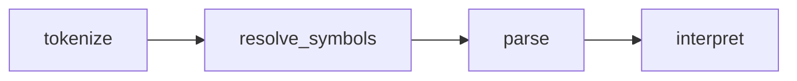

# Arithmetic Expression for Characters

This is a no dependency and `no_std` lib for tokenizing, parsing, then interpreting arithmetic expressions.

It has a reduced scope:

 - Floating point numbers are not supported.
 - Some operations are not supported (like division, as it could error at runtime).

## Flow

## Operations

Binary ops from highest to lowest precedence (all left-to-right associative):
 - Mul (*), Add (+)
 - Sub (-)
 - Left Shift (<<), Right Shift (>>)
 - Less Than (<), Less Than Equal (<=)
 - Greater Than (>), Greater Than Equal (>=)
 - Bitwise And (&)
 - Bitwise Xor (^)
 - Bitwise Or (|)
 - Equal (=), Not Equal (!=)

Unary ops:
 - Add (+)
 - Sub (-)
 - Bitwise Complement (~)

Brackets are used to change precedence. e.g. `(1 + 2) * 3`;

## Symbols

A list of allowed symbols can be provided during tokenization. Symbols must match the form:  
`[a-zA-Z_][a-zA-Z0-9_]*`. The values taken on by these symbols are given to the interpreter.

## Numbers

All values are `CodeUnit` (a compile-time type, should be `u32` or `u8`), and are explicitly allowed to underflow and overflow at runtime interpretation (but not at tokenization).

Numbers can be stated as:
 - Decimal: `123`
 - Character Literal contained within single quotes: `'n'`. 
 - Escaped Literal. Newline is `'\n'`. Escapable: `0abtnvfrex\`.
 - Escaped Hex Literal: `\xAF9f`.

## Diagnostics

Diagnostic information is given on error, in the form of an offending offset and reason.
  
<pre>
123 + 12 3
         ^ previous token forbids value

4294967296
^ number too large

symbol)
      ^ no matching left bracket

1 * * 3
  ^ stack exhausted
</pre>
